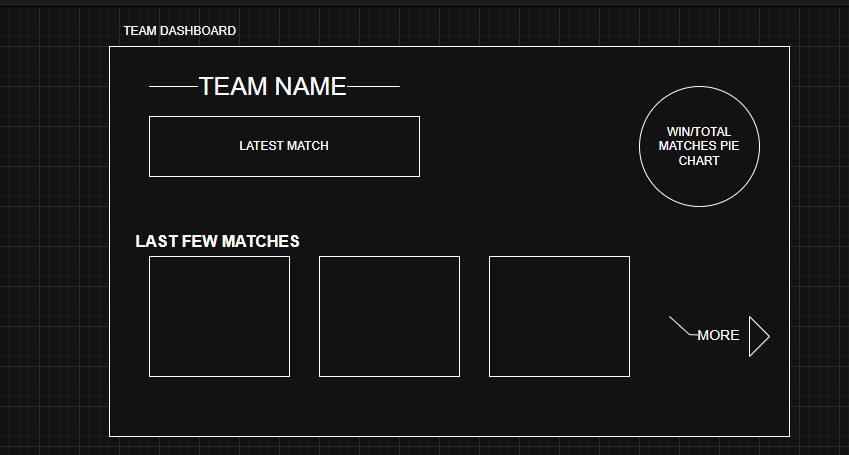

# 🏏 IPL Dashboard By Nutika

An interactive IPL dashboard to explore teams, match outcomes, and performance history using modern full-stack technologies.

---

## 🚀 Features

- Browse your **favourite IPL teams**
- View **match results** from previous tournaments
- Color-coded match outcomes:
  - 🟩 **Green** – Win
  - 🟥 **Red** – Loss
- See the **latest 3 matches** played by a selected team
- Click **"More"** to view **all matches** from previous seasons

---

## 🛠️ Technologies Used

### Backend

- **Spring Boot** – RESTful APIs
- **Spring Batch** – Data ingestion from Kaggle dataset
- **Java Persistence API (JPA)** – ORM for data handling
- **JPQL & JPA Repositories** – Database interaction
- **Spring MVC** – Web API framework

### Frontend

- **React.js** – Functional components with hooks
- **Hooks & useEffect** – State and side-effect management
- **CSS Grid** – Responsive and structured UI layout

### Deployment

- **AWS Elastic Beanstalk** – Hosting and deployment

---

## 📊 Data Source

- All IPL match data is sourced from **Kaggle**:  
  [Kaggle IPL Dataset](https://www.kaggle.com/datasets)

---

## ✍️ Raw Design (Before Development)

This was the initial handmade design/sketch for the IPL Dashboard:



> The design helped shape the UI layout and functionality before implementation.

## 🖥️ How It Works

1. Open the dashboard to see a list of IPL teams.
2. Click on any team to view:
   - The **latest 3 matches**.
   - Matches highlighted in **green (win)** or **red (loss)**.
3. Click **"More"** to view the complete match history of that team.

---

### ⚙️ Backend Setup (Spring Boot)

1. Clone the repository:
   ```bash
   git clone https://github.com/your-username/IPLDashboard_ByNutika.git
   cd IPLDashboard_ByNutika
   ```

### 🤝 Contributing

Contributions are welcome!
Feel free to fork this repo, submit issues, or send pull requests to improve functionality or design.

### 📬 Contact

Created by Nutika
For questions, feedback, or collaboration: nutikakumar123@gmail.com
