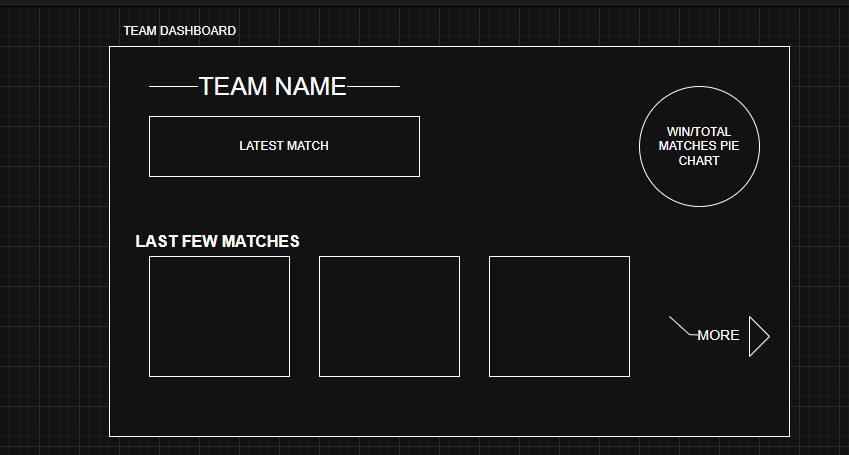

# 🛠️ Build Notes

This document captures the foundational steps, thought process, and planning behind the development of the IPL Dashboard project.

---

## 📂 Dataset Information

We began by identifying a reliable IPL dataset to power the application.

- The dataset is sourced from **Kaggle**:  
  [IPL Dataset (2008–2025) by Abhishek Marathe](https://www.kaggle.com/datasets/maratheabhishek/ipl-dataset-2008-to-2025?utm_source=chatgpt.com&select=ipl_matches_data.csv)

- We specifically used the **`ipl_matches_data.csv`** file, which contains detailed match-level data spanning all IPL seasons.

- Kaggle allows you to **customize the dataset** based on your project needs before downloading — so feel free to filter out unnecessary fields or seasons as required.

---

## 🧠 Planning Phase

Before jumping into development, we invested time in **application architecture** and **system design**. This helped ensure:

- Code scalability and modularity
- Clean separation of backend and frontend responsibilities
- Efficient data ingestion and querying
- Smooth UI/UX experience with minimal re-renders

To begin shaping the product visually, a **hand-drawn wireframe/UI sketch** was created. This sketch helped:

- Define the core layout
- Plan feature placement
- Guide frontend development with a visual reference

📌 You can find the initial sketch inside the `README.md` under the section:  
[✍️ Raw Design (Before Development)](README.md#️-raw-design-before-development)

## 🧱 System Design & Architecture

Each match in the IPL Dashboard can be visualized on a **dedicated detail page**, where we display comprehensive information such as:

- Who won the toss
- Match result
- Team performance
- Key stats and events

📷 Example of a match detail design:  

---

### 🧩 System Overview (Possible Architecture)

We considered using a **3-tier architecture** for scalability and separation of concerns:

1. **Frontend Tier** – React.js app to handle UI rendering.
2. **API Tier** – Spring Boot to serve REST APIs and business logic.
3. **Database Tier** – SQL-based storage for IPL data.

In such a setup, multiple Spring Boot instances could be deployed behind a load balancer, all connected to a shared database — allowing for horizontal scaling.

However, **this architecture is not implemented in the current version** of the project.

---

### 💡 Current Approach (Used in This Project)

Since the application only serves **read-only, view-based data**, we implemented a much simpler and faster setup:

- We use an **in-memory database (HSQLDB)** embedded inside each Spring Boot instance.
- The CSV file is loaded **locally on application startup** and parsed to populate the in-memory DB.
- So, our **Spring Boot application communicates directly with HSQLDB**, with no need for an external or persistent database.
- This approach eliminates the need for a separate ingestion process or data sharing across instances.

✅ Benefits:

- Lightweight and easy to set up
- No external database configuration required
- Ideal for development, prototyping, or showcasing the project

> ⚠️ Note: This setup is great for read-only dashboards but not suitable for write-heavy or collaborative environments.

---

### 🔄 Data Ingestion Logic

In a scalable production version, we would need to address questions like:

1. **Who populates the database from the CSV?**  
   → A dedicated batch processor like Spring Batch or a microservice to ingest CSV data.

2. **How do Spring Boot instances connect to the DB?**  
   → With shared DB credentials and connection settings via environment variables or config files.

3. **How is data refreshed or synchronized across instances?**  
   → Through shared DB or centralized data sync mechanisms.

But for this project, the **read-only, per-instance load into HSQLDB** is sufficient and efficient.

---
